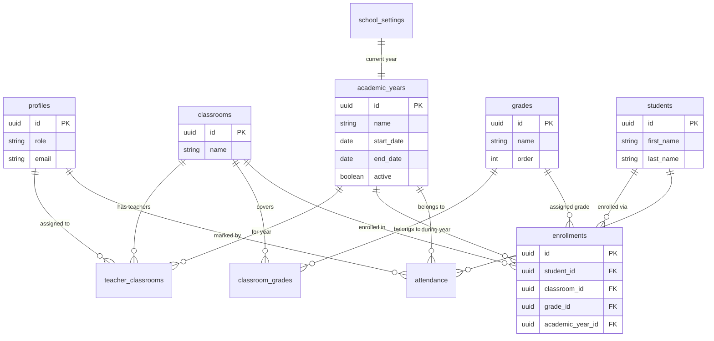

# Database Design & Schema

This document details the Supabase (PostgreSQL) database design for the VedicRoots Attendance System.

## Tables

### 1. `profiles`
Links to Supabase Auth. Stores user role and basic info.
| Column | Type | Description |
| :--- | :--- | :--- |
| `id` | UUID | Primary Key. References `auth.users(id)`. |
| `role` | TEXT | Enum: `'ADMIN'` or `'TEACHER'`. |
| `name` | TEXT | Display name. |
| `email`| TEXT | User email. |

### 2. `academic_years`
Defines academic sessions (e.g., "2025-2026").
| Column | Type | Description |
| :--- | :--- | :--- |
| `id` | UUID | Primary Key. |
| `name` | TEXT | E.g., "2025-2026". |
| `start_date` | DATE | Start of the academic year. |
| `end_date` | DATE | End of the academic year. |
| `active` | BOOLEAN | If this is the currently active year. |

### 3. `grades`
Standardized grades.
| Column | Type | Description |
| :--- | :--- | :--- |
| `id` | UUID | Primary Key. |
| `name` | TEXT | E.g., "JK", "SK", "Grade 1", ..., "Grade 7". |
| `order` | INTEGER | For sorting (e.g., 1, 2, 3). |
| `type` | ENUM | `'KINDERGARTEN'`, `'ELEMENTARY'` (For applying specific rules). |

### 4. `classrooms`
Physical or logical grouping (e.g., "Lower Elementary", "KG 1 A").
| Column | Type | Description |
| :--- | :--- | :--- |
| `id` | UUID | Primary Key. |
| `name` | TEXT | E.g., "Ashoka House", "Lower Elementary". |
| `capacity` | INTEGER | Optional max capacity. |

### 5. `classroom_grades`
Junction table: Defines which grades are taught in a classroom.
| Column | Type | Description |
| :--- | :--- | :--- |
| `classroom_id` | UUID | FK to `classrooms(id)`. |
| `grade_id` | UUID | FK to `grades(id)`. |

### 6. `enrollments`
Links students to a specific Grade and Classroom for a specific Academic Year.
| Column | Type | Description |
| :--- | :--- | :--- |
| `id` | UUID | Primary Key. |
| `student_id` | UUID | FK to `students(id)`. |
| `classroom_id` | UUID | FK to `classrooms(id)`. |
| `grade_id` | UUID | FK to `grades(id)`. |
| `academic_year_id` | UUID | FK to `academic_years(id)`. |

### 7. `students`
Students enrolled in the school (Global Profile).
| Column | Type | Description |
| :--- | :--- | :--- |
| `id` | UUID | Primary Key. |
| `first_name` | TEXT | |
| `last_name` | TEXT | |
| `profile_picture` | TEXT | URL to image. |

### 7.1 `student_vacations`
Tracks vacation periods for students.
| Column | Type | Description |
| :--- | :--- | :--- |
| `id` | UUID | Primary Key. |
| `student_id` | UUID | FK to `students(id)`. |
| `start_date` | DATE | First day of vacation. |
| `end_date` | DATE | Last day of vacation. |
| `reason` | TEXT | Optional reason. |

### 8. `teacher_classrooms`
Junction table: Assigns teachers to classrooms (Can be year-specific or global, assuming global for now or managed manually).
| Column | Type | Description |
| :--- | :--- | :--- |
| `teacher_id` | UUID | FK to `profiles(id)`. |
| `classroom_id` | UUID | FK to `classrooms(id)`. |
| `academic_year_id` | UUID | FK to `academic_years(id)` (Optional: to track history). |

### 9. `attendance`
Daily attendance records.
| Column | Type | Description |
| :--- | :--- | :--- |
| `id` | UUID | Primary Key. |
| `student_id` | UUID | FK to `students(id)`. |
| `date` | DATE | The date of the record. |
| `status` | ENUM | `'PRESENT'`, `'ABSENT'`, `'LATE'`, `'UNMARKED'`. |
| `marked_by` | UUID | FK to `profiles(id)` (User who marked it). |
| `timestamp` | TIMESTAMPTZ | When it was last updated. |
| `arrival_time` | TIME | Optional time for late arrivals. |
| `academic_year_id` | UUID | FK to `academic_years(id)`. |

### 10. `school_settings`
Global configuration.
| Column | Type | Description |
| :--- | :--- | :--- |
| `id` | UUID | Primary Key. |
| `school_name` | TEXT | Default "VedicRoots". |
| `current_academic_year_id` | UUID | FK to `academic_years(id)`. |
| `cutoff_time_kg` | TIME | Default "09:15:00". |
| `cutoff_time_elementary` | TIME | Default "09:00:00". |
| `late_fee_per_minute` | DECIMAL | Default 1.00. |

## Row Level Security (RLS) Policies

### View Access
- **Admins & Teachers**: Can view all related data if authenticated.
- **Specifics**: 
    - `profiles`, `classrooms`, `school_settings`: Publicly readable or Authenticated readable.
    - `students`, `attendance`: Authenticated readable.

### Write Access
- **Profiles**: Users can update their own profile.
- **Attendance**: 
    - **Teachers**: Can `INSERT` and `UPDATE` records ONLY for students in classrooms they are assigned to.
    - **Admins**: (Implied full access via service role or admin specific policy if needed).

## Relationships Diagram

